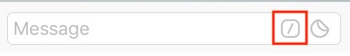

Slashing Guard is a [monitoring service](docs/slashing-guard-flow.png) for LIDO node operators that will alarm your team instantly via [Telegram](https://telegram.org/) if a validator is getting slashed.

# Table of Contents

- [Requirements and Prerequisites](#requirements-and-prerequisites)

* [Usage](#usage)
  - [Configuration](#configuration)
    - [Options](#options)
    - [Config file](#config-file)
    - [Environment variables](#environment-variables)
  - [Getting Started](#getting-started)
    - [Run with Docker](#run-with-docker)
      - [Images](#images)
      - [Quick start with Docker](#quick-start-with-docker)
    - [Run from source](#run-from-source)
      - [Quick start from source](#quick-start-from-source)
      - [Build your Docker image locally](#build-your-docker-image-locally)
  - [Telegram Bot](#telegram-bot)
    - [User Subscription](#user-subscription)
    - [Group Subscription](#group-subscription)
    - [Bot Commands](#bot-commands)

- [Contributing](#contributing)
  - [Recommended Software](#recommended-software)
  - [Pull Requests](#pull-requests)
  - [Unit Testing and Linting](#unit-testing-and-linting)
  - [Style Guide](#style-guide)

* [Contact](#contact)

# Requirements and Prerequisites

Before you start with the Slashing Guard application you need:

1. API access to a **fully synced** Ethereum Beacon node ([Consensus Client](https://ethereum.org/en/developers/docs/nodes-and-clients/#consensus-clients))
2. API access to a running [LIDO KAPI service](https://github.com/lidofinance/lido-keys-api)
3. Install [Docker](https://docs.docker.com/get-docker/) or optional [NodeJS](https://nodejs.org/) and [npm](https://www.npmjs.com/) (depending on your needs)
4. Install [Telegram Messenger](https://telegram.org/) and create your alarming bot

While the [Docker installation](https://docs.docker.com/get-docker/) (#3) is a straight forward task, [Stereum](https://stereum.net/) would be the recommended solution to setup and configure a fresh Beacon node (#1) along with the LIDO KAPI service (#2).

Afterwards you can create a new Telegram bot (#4) as follows:

1. Open your [Telegram Messenger](https://telegram.org/)
2. Search for BotFather and create your new bot


> Make sure you choose the valid one (see the blue verified sign on the screenshot)

3. Store your new bot token on a safe location (you will need that later on)

As soon as the prerequisites are done, the [Slashing Guard setup can start](#usage).

# Usage

There are multiple ways you can configure and run the Slashing Guard application. While [the recommended setup for production environments is Docker](#run-with-docker), it is also possible to [run the app directly from source with NodeJS](#run-from-source), which is mostly preferred for development on your local system, however also an absolutely valid setup for production.

## Configuration

The Slashing Guard [options](#options) must be configured either thru a .env [config file](#config-file) or [environment variables](#environment-variables).

### Options

| Name               | Default               | Required | Description                                                     |
| ------------------ | --------------------- | -------- | --------------------------------------------------------------- |
| TELEGRAM_BOT_TOKEN | YourBotToken          | Yes      | The token received by Telegrams BotFather on bot creation       |
| ETH_URL            | http://localhost:5051 | Yes      | The URL to your Beacon node API (Consensus Client)              |
| KAPI_URL           | http://localhost:3600 | Yes      | The URL to your LIDO Keys API (KAPI)                            |
| OPERATOR_NAME      | YourLidoOperatorName  | Yes      | Official LIDO node operator name (available thru KAPI service)   |
| LOG_LEVEL          | info                  | No       | Log Level: "fatal", "error", "warn", "info", "debug" or "trace" |
| FAKE_KEYS          | `<string:empty>`      | No       | For development and debugging (see description in .env.example) |

### Config file

By default the Slashing Guard attempts to read the configuration from an `.env` file where you add the [config options](#options).

Example `.env.example` (see [.env.example](./.env.example)):

```
# Bot token that was received from Telegram "BotFather"
TELEGRAM_BOT_TOKEN=YourBotToken

# API url of a fully synced consensus node
ETH_URL="http://localhost:5051"

# API url of your LIDO KAPI service
KAPI_URL="http://localhost:3600"

# Your LIDO operator name
OPERATOR_NAME=YourLidoOperatorName
```

### Environment variables

You can also configure the Slashing Guard [options](#options) by environment variables. They will overwrite all identical [options](#options) that are already defined in the [config file](#config-file).

Environment variables must be always **UPPERCASE**.
For example, to specify `OPERATOR_NAME` as environment variable:

```
export OPERATOR_NAME="MyLidoOperatorName"
npm i
npm run start:dev
```

## Getting started

The recommended setup for production environments is to [run the Slashing Guard with Docker](#run-with-docker) but it is also possible to [run the Slashing Guard directly from source with NodeJs](#run-from-source). Make sure you've read the [configuration section](#configuration) and then you're good to go.

### Run with Docker

1. Verify that all [requirements and prerequisites](#requirements-and-prerequisites) are met.
2. Pull the Slashing Guard Docker Image ([stereum/slashing-guard](https://hub.docker.com/r/stereum/slashing-guard/tags)) from Docker Hub and follow the [quick start with Docker](#quick-start-with-docker) or [build your Docker image locally](#build-your-docker-image-locally).

#### Images

- `latest` - latest release of the Slashing Guard on node:19-alpine
- `$version` - specific release (e.g.: `v0.0.1`) of the Slashing Guard on node:19-alpine

#### Quick start with Docker

1. Create a directory (e.g: slashing-guard) where you want your Slashing Guard app running

```
mkdir slashing-guard
cd slashing-guard
```

2. Copy [.env.example](./.env.example) to `.env` and [configure](#configuration) as needed

```
wget -O .env https://raw.githubusercontent.com/stereum-dev/slashing-guard/main/.env.example
```

3. Copy [docker-compose.yaml.example](./docker-compose.yaml.example) to `docker-compose.yaml`

```
wget -O docker-compose.yaml https://raw.githubusercontent.com/stereum-dev/slashing-guard/main/docker-compose.yaml.example
```

4. Start the Slashing Guard Docker container (detached):

```
sudo docker compose --project-name slashing-guard up -d
```

**Important**

Note that the Slashing Guard application is creating a folder called "**database**" inside your application root.
This is a [level-db](https://github.com/google/leveldb) storage used to register and ping your bot subscribers.
It is highly recommended to regulary backup this database folder to retain your bot subscribers in case of an disaster.

> Deleting the database folder will require all bot subscribers to renew their subscription!

> To monitor logs of your Docker container use `docker logs -f slashing-guard`

> To stop your Docker container use `docker compose --project-name slashing-guard down`

5. Open Telegram and [configure your bot](#telegram-bot)

See the [Telegram Bot](#telegram-bot) section to do so.

### Run from source

1. Download a release from the [releases page](https://github.com/stereum-dev/slashing-guard/releases) (or clone the GitHub repository).
2. Refer to the [official NodeJS docs](https://nodejs.org/en/docs) to install [NodeJS >= 16](https://nodejs.org/en/download) on your OS.
3. Refer to the [official npm docs](https://docs.npmjs.com/downloading-and-installing-node-js-and-npm) to install **npm** on your OS.
4. Extract the release (or continue directly with step #5 if you just cloned the GitHub repository).
5. Follow the [quick start from source](#quick-start-from-source) examples.

#### Quick start from source

1. Move to the directory (e.g: slashing-guard) where you have unpacked or cloned the Slashing Guard app

```
cd slashing-guard
```

2. Copy [.env.example](./.env.example) to `.env` and [configure](#configuration) as needed
3. Start the Slashing Guard app from source:

```
npm i
npm run start:dev
```

#### Build your Docker image locally

You can also build your Docker image locally from source as follows:

1. Move to the directory (e.g: slashing-guard) where you have unpacked or cloned the Slashing Guard app

```
cd slashing-guard
```

2. Copy [.env.example](./.env.example) to `.env` and [configure](#configuration) as needed
3. Copy [docker-compose.yaml.example](./docker-compose.yaml.example) to `docker-compose.yaml`
4. Build your docker image:

```
docker compose --project-name slashing-guard build
```

5. Start the Slashing Guard app from your local Docker build:

```
docker compose --project-name slashing-guard up
```

You can stop the Docker container by typing `CTRL+C` in your active terminal.

## Telegram Bot

As soon as Slashing Guard is [up and running](#quick-start-with-docker) your bot is available in [Telegram](https://telegram.org/).

[Users](#user-subscription) and [groups](#group-subscription) can get alarmed instantly from the bot if one of your validators got slashed - both require a subscription.

### User Subscription

Each user can subscribe to your bot by searching for the bot name (you got from BotFather) in the Telegram user list or by requesting http://t.me/BOTNAME and running the bot command `/start@BOTNAME`.

Telegram is usually providing a "Start" button to run `/start@BOTNAME` automatically as soon as the chat window of the bot is joined by the user.

From now the bot is subscribed and alert notifications will be sent to the user.

To unsubscribe, the user needs to run `/stop@BOTNAME` inside the bot chat.

> Replace BOTNAME with the name you received for your bot by BotFather

### Group Subscription

It is also possible to receive alert notifications for a whole group.
To do so, add the bot to a group and subscribe the group.

First you need to search for the bot name (you got from BotFather) in the Telegram user list or by requesting http://t.me/BOTNAME and assign the bot to your group.

Second, run `/start@BOTNAME` inside your group chat.

From now the bot is subscribed and alert notifications will be sent to the group.

To unsubscribe the group, run `/stop@BOTNAME` inside your group chat.

> Replace BOTNAME with the name you received for your bot by BotFather

## Bot Commands

In addition to the alert notification that are retrieved after a user or group is subscribed, the bot also supports a few other commands.
Bot commands always start with a slash (**/**) and Telegram also provides a UI for that.

- In the bot chat a menu icon lists bot commands

  

- In the group chat a slash icon lists bot commands

  

Currently the Slashing Guard bot supports the following commands:

| Name     | Description                                                                           |
| -------- | ------------------------------------------------------------------------------------- |
| start    | Subscribe a [user](#user-subscription) or [group](#group-subscription) to the bot     |
| status   | Get current service status                                                            |
| operator | Get operator details                                                                  |
| stop     | Unsubscribe a [user](#user-subscription) or [group](#group-subscription) from the bot |

All commands must be pre-fixed with a slash and su-fixed with "@" and the bot name (e.g: `/start@botname`)

For further information please visit the [Telegram bot features](https://core.telegram.org/bots/features) page.

# Contributing

Contributions are greatly appreciated and pull requests will be reviewed/merged ASAP!

### Recommended Software

The easiest way to follow our [Style Guide](#style-guide) and [contributor workflow](#pull-requests) is to use [Visual Studio Code (VSCode)](https://code.visualstudio.com/) as IDE with at least the following extensions added:

- [Prettier](https://marketplace.visualstudio.com/items?itemName=esbenp.prettier-vscode)
- [ESLint](https://marketplace.visualstudio.com/items?itemName=dbaeumer.vscode-eslint)
- [GitLens](https://marketplace.visualstudio.com/items?itemName=eamodio.gitlens)

This document will explain all further steps assuming you are using [VSCode](https://code.visualstudio.com/) and the mentioned extensions.

> If you are using Windows, we strongly recommend you to [use Git Bash as terminal inside VSCode](https://www.geeksforgeeks.org/how-to-integrate-git-bash-with-visual-studio-code/)!

### Pull Requests

To improve the Slashing Guard code please follow these steps:

1. Fork the project
2. Create your feature branch:
   - `git checkout -b feat/new-feature`
3. Commit your changes:
   - `git commit -m "feat(optional): new feature"`
4. Push the branch: -`git push origin feat/new-feature`
5. Open a pull request

> Note: To test your changes in a local Docker container see the [Build your Docker image locally Example](#build-your-docker-image-locally).

### Unit Testing and Linting

All pull requests running thru automated tests. It is recommended to run these tests locally before you open a pull request.

- Setup your local development environment, thus you're able to [run from source](#run-from-source)
- Execute `npm i` to install packages (before you run the commands below!)
- Execute `npm test .test` to run Unit Tests (where no errors as result means passed)
- Execute `npm run lint:fix` to run Lint Tests with code formatting (where no errors as result means passed)

### Style Guide

If you use the [recommended software and extensions](#recommended-software) usually everything is already auto formatted and/or code issues are announced in the "Problems" tab of [VSCode](https://code.visualstudio.com/).

However, here are a few hints you may follow to keep your code clean and pass automated tests:

- Make sure your code is properly linted:
  - Use an IDE that will show linting errors/warnings
  - Execute `npm run lint:fix` from the command line
  - Common rules:
    - Functions and variables should be [camelCase](https://en.wikipedia.org/wiki/Camel_case)
    - Classes should be [PascalCase](http://wiki.c2.com/?PascalCase)
    - Constants should be `UPPERCASE_WITH_UNDERSCORES`
    - Use `"` instead of `'`

> You only have to take care about linting issues of files you have changed

- Make sure that jest tests are passing:
  - run `npm run test .test` from the command line

> Pull requests must pass all automated Jest tests to get accepted

- Comments:
  - If your code does something that is not obvious or deviates from standards, please leave a comment for other developers to explain your logic and reasoning
  - Use `//` commenting format as default
  - Optional use `/* */` commenting format for documenting a function, class or variable
  - Keep comments short and simple

# Contact

[](https://discord.gg/8Znj8K6GjN)

To get in touch just [join the Stereum Discord server](https://discord.gg/8Znj8K6GjN) and leave a message in one of the public channels - we are happy to get your feedback!
